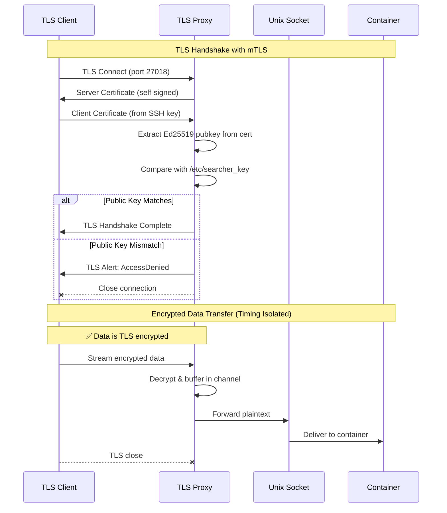

# Input Only Proxy

A unidirectional TCP to Unix socket proxy with TLS encryption and Ed25519 authentication for TDX environments.

## Overview

This proxy allows authenticated clients to stream data into a container through a Unix socket. It provides:

- **TLS 1.3 encryption** with mutual authentication
- **Ed25519 authentication** using existing SSH public keys
- **Unidirectional data flow** (TCP client → Unix socket only)
- **Support for large data transfers** (multi-GB streaming)
- **Timing attack prevention** via unbounded buffering

## Protocol



## Key Security Properties

1. **Encryption**: Full TLS 1.3 encryption for all data
2. **Authentication**: Only clients with the private key can connect (Ed25519 mTLS)
3. **Timing Isolation**: The unbounded channel between TLS reader and Unix writer prevents the container's consumption speed from affecting TCP timing, preventing timing side-channel attacks
4. **Unidirectional**: Data flows only from client to container, no backchannel

## Building

```bash
cargo build --release
```

## Usage

### Server
```bash
# Basic usage with defaults
./target/release/input-only-proxy

# Custom configuration
./target/release/input-only-proxy \
    --listen 0.0.0.0:27018 \
    --unix-socket /persistent/input/input.sock \
    --pubkey-file /etc/searcher_key \  # SSH public key (ed25519)
    --server-cert-path /persistent/server.crt \
    --server-key-path /persistent/server.key
```

### Client
```bash
# Step 1: Convert SSH key to TLS certificate (one time)
./scripts/ssh_to_tls_cert.py ~/.ssh/id_ed25519 client-cert.pem

# Step 2: Connect with TLS client (accepts any server certificate)
cargo run --example tls_client -- 127.0.0.1:27018 client-cert.pem

# Alternative: Connect with server certificate verification
cargo run --example tls_client -- 127.0.0.1:27018 client-cert.pem server.crt
```

### Testing Locally

1. Start the Unix socket listener (simulates container):
```bash
cargo run --example unix_listener
```

2. Start the proxy with your SSH **public** key (in another terminal):
```bash
cargo run -- \
    --unix-socket /tmp/test_input.sock \
    --pubkey-file ~/.ssh/id_ed25519.pub \
    --server-cert-path /tmp/server.crt \
    --server-key-path /tmp/server.key
```

3. Generate client certificate and connect (in third terminal):
```bash
# Generate certificate (one time)
./ssh_to_tls_cert.py ~/.ssh/id_ed25519 client-cert.pem

# Connect (accepts any server certificate)
cargo run --example tls_client -- 127.0.0.1:27018 client-cert.pem

# Alternative: Connect with server certificate verification
cargo run --example tls_client -- 127.0.0.1:27018 client-cert.pem /tmp/server.crt
```

## Configuration

| Flag | Default | Description |
|------|---------|-------------|
| `--listen` | `0.0.0.0:27018` | TLS address to listen on |
| `--unix-socket` | `/persistent/input/input.sock` | Unix socket path to forward to |
| `--pubkey-file` | `/etc/searcher_key` | SSH Ed25519 public key file |
| `--server-cert-path` | `/persistent/server.crt` | Server TLS certificate file (auto-generated if missing) |
| `--server-key-path` | `/persistent/server.key` | Server TLS private key file (auto-generated if missing) |
| `--log-level` | `info` | Logging level (via `RUST_LOG` env var) |


## Security Features

- **TLS 1.3 Encryption**: All data is encrypted in transit
- **Mutual Authentication**: Client certificates derived from SSH Ed25519 keys
- **Unidirectional flow**: Data flows only from client to container (no backchannel)
- **Timing isolation**: Unbounded buffering prevents timing side-channel attacks
- **SSH key compatible**: Works with existing SSH Ed25519 keys

## License

MIT