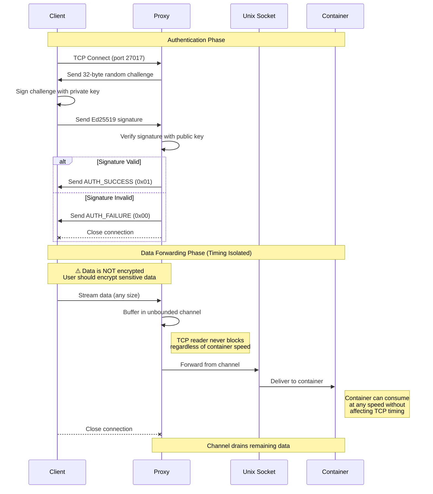
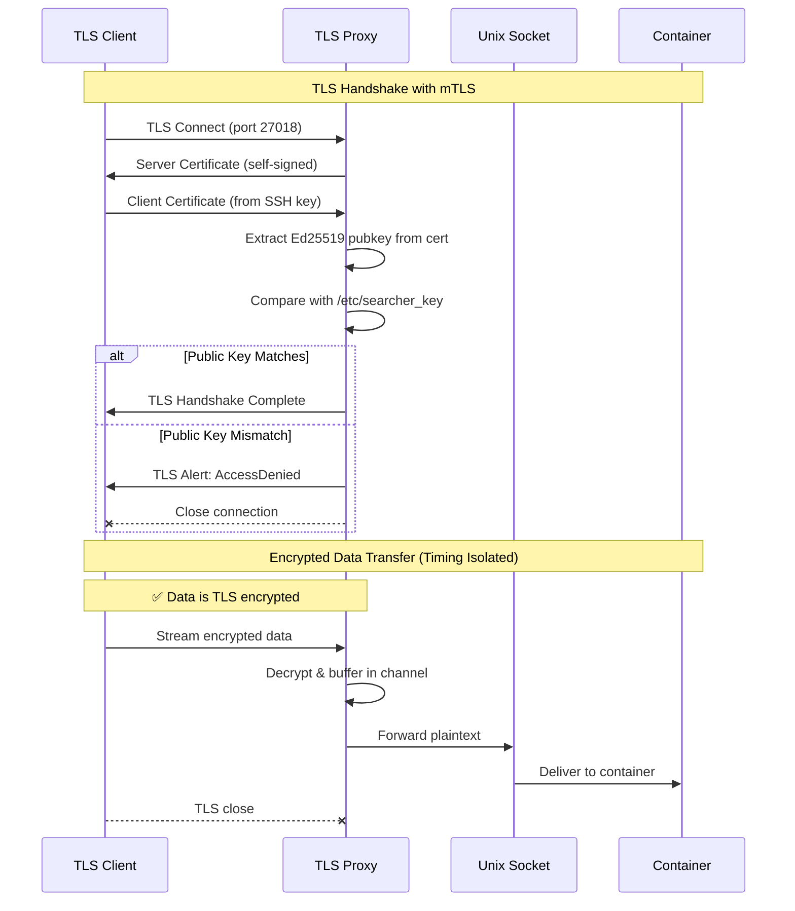

# Input Only Proxy

A unidirectional TCP to Unix socket proxy with Ed25519 authentication for TDX environments.

## Overview

This proxy allows authenticated clients to stream data into a container through a Unix socket. It provides:

- **Ed25519 authentication** using SSH public keys (both challenge-response and TLS modes)
- **Unidirectional data flow** (TCP client → Unix socket only)
- **Support for large data transfers** (multi-GB streaming)
- **Timing attack prevention** via unbounded buffering
- **Two modes**: Plain TCP with challenge-response or TLS with mutual authentication

## Protocol Options

### Option 1: Plain TCP with Challenge-Response



### Option 2: TLS with Mutual Authentication (Recommended)



### Key Security Properties

1. **Authentication**: Only clients with the private key can connect
2. **Timing Isolation**: The unbounded channel between TCP reader and Unix writer prevents the container's consumption speed from affecting TCP timing, preventing timing side-channel attacks
3. **Unidirectional**: Data flows only from client to container, no backchannel
4. **Encryption**: 
   - Plain TCP mode: No encryption, users should encrypt sensitive data
   - TLS mode: Full TLS 1.3 encryption with Ed25519 certificates

## Building

```bash
cargo build --release
```

## Usage

### Plain TCP Mode

#### Server
```bash
# Basic usage with defaults
./target/release/input-only-proxy

# Custom configuration
./target/release/input-only-proxy \
    --listen 0.0.0.0:27017 \
    --unix-socket /persistent/input/input.sock \
    --pubkey-file /etc/searcher_key  # SSH public key (e.g., id_ed25519.pub)
```

#### Client
```bash
# Using SSH private key (note: private, not .pub)
cargo run --example client -- 127.0.0.1:27017 ~/.ssh/id_ed25519

# Using hex-encoded private key file
echo "0123456789abcdef0123456789abcdef0123456789abcdef0123456789abcdef" > test.key
cargo run --example client -- 127.0.0.1:27017 test.key
```

### TLS Mode (Recommended)

#### Server
```bash
# Run TLS-enabled proxy
cargo run --bin input-proxy-tls -- \
    --listen 0.0.0.0:27018 \
    --unix-socket /persistent/input/input.sock \
    --pubkey-file /etc/searcher_key  # SSH public key
```

#### Client
```bash
# Step 1: Convert SSH key to TLS certificate (one time)
./ssh_to_tls_cert.py ~/.ssh/id_ed25519 client-cert.pem

# Step 2: Connect with TLS client
cargo run --example tls_client -- 127.0.0.1:27018 client-cert.pem
```

### Testing Locally

#### Plain TCP Mode
1. Start the Unix socket listener (simulates container):
```bash
cargo run --example unix_listener
```

2. Start the proxy with your SSH **public** key (in another terminal):
```bash
cargo run -- --unix-socket /tmp/test_input.sock --pubkey-file ~/.ssh/id_ed25519.pub
```

3. Run the client with your SSH **private** key (in third terminal):
```bash
cargo run --example client -- 127.0.0.1:27017 ~/.ssh/id_ed25519
```

#### TLS Mode
1. Start the Unix socket listener (simulates container):
```bash
cargo run --example unix_listener
```

2. Start the TLS proxy with your SSH **public** key:
```bash
cargo run --bin input-proxy-tls -- \
    --unix-socket /tmp/test_input.sock \
    --pubkey-file ~/.ssh/id_ed25519.pub
```

3. Generate client certificate and connect:
```bash
# Generate certificate (one time)
./ssh_to_tls_cert.py ~/.ssh/id_ed25519 client-cert.pem

# Connect
cargo run --example tls_client -- 127.0.0.1:27018 client-cert.pem
```

## Configuration

| Flag | Default | Description |
|------|---------|-------------|
| `--listen` | `0.0.0.0:27017` | TCP address to listen on |
| `--unix-socket` | `/persistent/input/input.sock` | Unix socket path to forward to |
| `--pubkey-file` | `/etc/searcher_key` | SSH Ed25519 public key file |
| `--log-level` | `info` | Logging level (via `RUST_LOG` env var) |


## Security Features

- **Authentication**: Only holders of the private key can authenticate
- **Unidirectional flow**: Data flows only from client to container (no backchannel)
- **Timing isolation**: Unbounded buffering prevents timing side-channel attacks
- **SSH key compatible**: Works with existing SSH Ed25519 keys
- **Encryption options**: 
  - Plain TCP: No encryption (users should encrypt sensitive data)
  - TLS mode: Full TLS 1.3 encryption with mutual authentication

## License

MIT