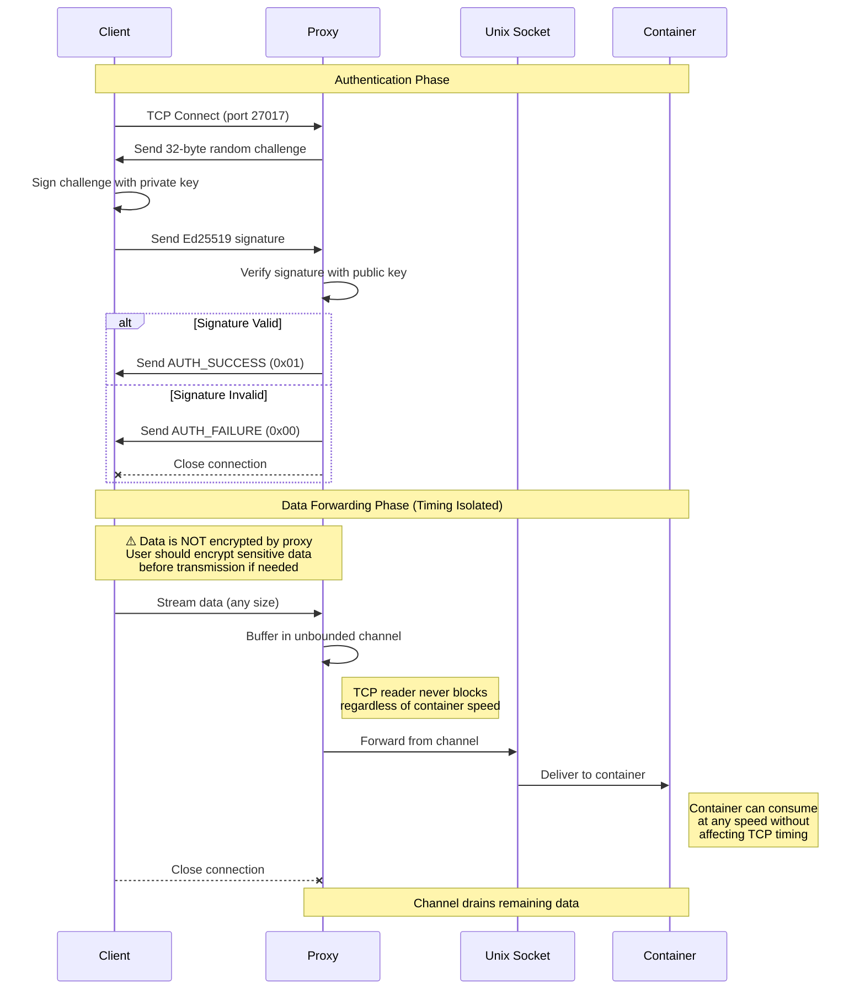

# Secure Input Proxy

A secure, unidirectional TCP to Unix socket proxy with Ed25519 authentication for TDX environments.

## Overview

This proxy allows authenticated clients to stream data into a container through a Unix socket. It provides:

- **Ed25519 challenge-response authentication** using SSH public keys
- **Unidirectional data flow** (TCP client → Unix socket only)
- **Support for large data transfers** (multi-GB streaming)
- **Timing attack prevention** via unbounded buffering
- **Simple protocol**: authenticate once, then stream unlimited data

## Protocol Flow



### Key Security Properties

1. **Authentication**: Only clients with the private key can connect
2. **Timing Isolation**: The unbounded channel between TCP reader and Unix writer prevents the container's consumption speed from affecting TCP timing, preventing timing side-channel attacks
3. **Unidirectional**: Data flows only from client to container, no backchannel
4. **No Built-in Encryption**: The proxy forwards data as-is after authentication. Users should implement their own encryption for sensitive data

## Building

```bash
cargo build --release
```

## Usage

### Server (Proxy)

```bash
# Basic usage with defaults
./target/release/secure-input-proxy

# Custom configuration
./target/release/secure-input-proxy \
    --listen 0.0.0.0:27017 \
    --unix-socket /persistent/input/input.sock \
    --pubkey-file /etc/searcher_key  # SSH public key (e.g., id_ed25519.pub)
```

### Client Example

```bash
# Using SSH private key (note: private, not .pub)
cargo run --example client -- 127.0.0.1:27017 ~/.ssh/id_ed25519

# Using hex-encoded private key file
echo "0123456789abcdef0123456789abcdef0123456789abcdef0123456789abcdef" > test.key
cargo run --example client -- 127.0.0.1:27017 test.key
```

### Testing Locally

1. Start the Unix socket listener (simulates container):
```bash
cargo run --example unix_listener
```

2. Start the proxy with your SSH **public** key (in another terminal):
```bash
cargo run -- --unix-socket /tmp/test_input.sock --pubkey-file ~/.ssh/id_ed25519.pub
```

3. Run the client with your SSH **private** key (in third terminal):
```bash
cargo run --example client -- 127.0.0.1:27017 ~/.ssh/id_ed25519
```

## Configuration

| Flag | Default | Description |
|------|---------|-------------|
| `--listen` | `0.0.0.0:27017` | TCP address to listen on |
| `--unix-socket` | `/persistent/input/input.sock` | Unix socket path to forward to |
| `--pubkey-file` | `/etc/searcher_key` | SSH Ed25519 public key file |
| `--log-level` | `info` | Logging level (via `RUST_LOG` env var) |


## Security Features

- **Authentication**: Only holders of the private key can authenticate
- **Unidirectional flow**: Data flows only from client to container (no backchannel)
- **Timing isolation**: Unbounded buffering prevents timing side-channel attacks
- **SSH key compatible**: Works with existing SSH Ed25519 keys
- **No encryption**: Data is forwarded as-is (users should encrypt sensitive data if needed)

## License

MIT